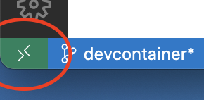

# Devcontainers & GitHub Codespaces

This repository has devcontainers available. They are a standard way to run development completely isolated. You find more information about them on https://containers.dev.
This documentation focuses on getting up and running and will not get into details about how devcontainers work.

Devcontainers can be run locally or in the cloud with GitHub Codespaces. Each have their advantages and drawbacks.  
**Codespaces** are generally instant to start and immediately ready to run. However you need a (somewhat) stable internetconnection to work and they might cost something (for hobby use the free usafe will probably be enough: https://github.com/features/codespaces#pricing).  
**Locallly** running the devcontainers has the advantage that it's always free and doesn't need an internet connection to work but they need some time to pull all the docker images and ruby gems and to seed the database with initial test data.

## Locally running

To get started with locally running the devcontainers, you need the following:
- [docker](https://docs.docker.com/get-docker/) and the [docker compose plugin](https://docs.docker.com/compose/install/)
- [Visual studio code](https://code.visualstudio.com)
- The [dev container extension](https://marketplace.visualstudio.com/items?itemName=ms-vscode-remote.remote-containers)

_You'll find more detailed requirements [here](https://code.visualstudio.com/docs/devcontainers/containers#_getting-started)._

1. To start testing, open this repository in VS Code and click on the green remote development button in the lower left corner of the window:  

2. In the menu that pops up, select "Reopen in Container"
3. Select the variant (wagon) you want to run.
4. Grab a coffee! The dev container will start which takes quite some time (depending on your computer this might take over 15min). It will clone the wagons, install all the ruby gems and migrate as well as seed the database.

## Running on GitHub Codespaces

_TBD_

## Rebuilding

_TBD_

## A note about committing and pushing

When running the devcontainer locally, you should be able to commit and push as normal even from inside the container (vs code passes through authentication). Please keep in mind though, that the devcontainer clones the core and wagons via http and from the main repositories, so you probably first need to add your fork as a git remote (`git remote add <remote-name> <url>`)

When running in codespaces, it becomes a bit more tricky. I did not yet fully investigate this scenario, you might find some hints [here](https://docs.github.com/en/codespaces/managing-your-codespaces/managing-repository-access-for-your-codespaces) or [here](https://docs.github.com/en/codespaces/prebuilding-your-codespaces/allowing-a-prebuild-to-access-other-repositories). Please open a PR if you have this working and extend this documentation!